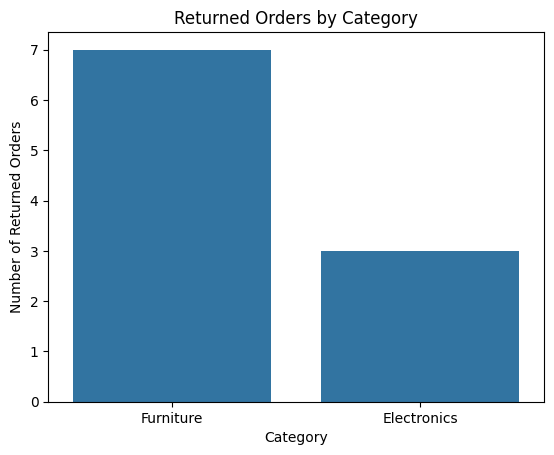

# 📊 XYZ Company Sales Analysis

This project analyzes XYZ Company's order dataset using **Python (pandas, matplotlib)**, **SQL**, **DAX** and **Power BI** to uncover actionable business insights.

---

## 🔍 Project Overview
We aim to understand:
- Revenue distribution by product category
- Top-performing and low-performing products
- Key cities contributing to sales and returns
- Customer payment preferences
- Return and cancellation patterns

---

## 📈 Key Findings
- **Total Sales:** ₹3,312,100  
- **High-Value Sales (Delivered):** ₹1,236,000  
- **Cancellation Rate:** **5.32%**

**Insights:**
- **Category Performance:** Electronics contributes **54.24%** of revenue, followed by Furniture.
- **Top Product:** `Laptop` (₹72,000 each),contributed **₹562,000** in sales.
- **Lowest Performing Product:** `Coffee Table` (₹6,800 each).
- **Geographical Trends:** **Mumbai** recorded the highest number of orders (16).
- **Payment Trends:** **UPI** is the most preferred payment method (24.47%).
- **Returns:** Furniture has the highest return rate; Delhi shows maximum returns , potential quality/control issue to investigate.

---

## 📊 Visualizations

---

## 🛠 Tech Stack
- **Python:** pandas, matplotlib, seaborn  
- **Power BI:** for interactive dashboard  
- **SQL:** for querying and filtering data  

---

## 🚀 Future Scope
- Predictive analysis for sales forecasting  
- Customer segmentation using clustering  
- Return-rate reduction strategies based on city & category data  

---

